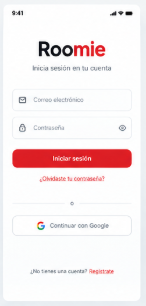
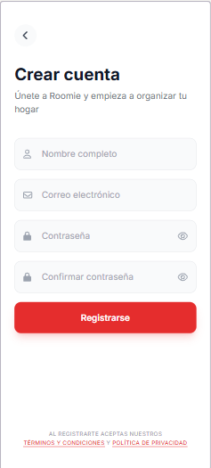
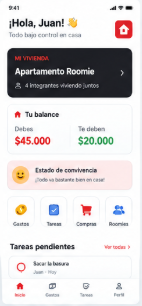
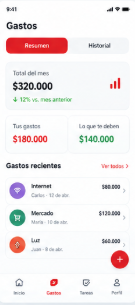
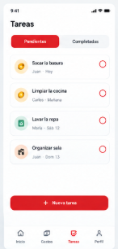
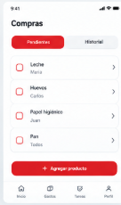
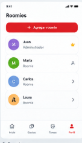
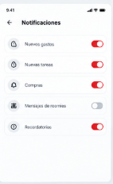
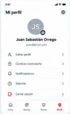

## Prototipo visual

El prototipo visual de Roomie representa las principales pantallas de la aplicación y el flujo de navegación entre sus diferentes funcionalidades.

### 1. Inicio de sesión

**Descripción:**  
Permite al usuario ingresar a Roomie utilizando su correo electrónico y contraseña. También permite acceder al registro de una nueva cuenta o a la recuperación de contraseña.

**Funciones principales:**
- Inicio de sesión.
- Acceso al registro.
- Recuperación de contraseña.

---

### 2. Registro

**Descripción:**  
Permite crear una nueva cuenta ingresando los datos personales del usuario.

**Funciones principales:**
- Registro de usuario.
- Ingreso de nombre y correo.
- Creación y confirmación de contraseña.
- Regreso al inicio de sesión.

---

### 3. Home / Inicio

**Descripción:**  
Es la pantalla principal de Roomie. Presenta un resumen de la vivienda y permite acceder rápidamente a las principales funciones de la aplicación.

**Funciones principales:**
- Resumen de gastos.
- Resumen de tareas.
- Información de los integrantes.
- Acceso a gastos, tareas, compras y roomies.
- Acceso a notificaciones.

---

### 4. Gastos

**Descripción:**  
Permite administrar los gastos realizados dentro de la vivienda y consultar los saldos entre los integrantes.

**Funciones principales:**
- Registrar gastos.
- Consultar gastos.
- Consultar deudas y saldos.
- Filtrar gastos pendientes y pagados.
- Consultar detalles de los gastos.

---

### 5. Tareas

**Descripción:**  
Permite organizar las responsabilidades y tareas de la vivienda.

**Funciones principales:**
- Crear tareas.
- Asignar responsables.
- Establecer prioridades.
- Definir fechas.
- Marcar tareas como completadas.
- Filtrar tareas pendientes y completadas.

---

### 6. Lista de compras

**Descripción:**  
Permite administrar los productos que deben comprarse para la vivienda.

**Funciones principales:**
- Agregar productos.
- Definir cantidades.
- Clasificar productos por categorías.
- Marcar productos como comprados.
- Eliminar productos.
- Filtrar productos.

---

### 7. Roomies

**Descripción:**  
Permite consultar y administrar los integrantes de la vivienda compartida.

**Funciones principales:**
- Consultar integrantes.
- Visualizar roles.
- Consultar balances.
- Invitar nuevos roomies.
- Administrar integrantes.

---

### 8. Notificaciones

**Descripción:**  
Centraliza los avisos relacionados con las actividades de la vivienda.

**Funciones principales:**
- Consultar notificaciones.
- Marcar notificaciones como leídas.
- Acceder a la sección relacionada con cada notificación.
- Eliminar notificaciones.

---

### 9. Perfil

**Descripción:**  
Permite administrar la información personal y algunas configuraciones de la cuenta.

**Funciones principales:**
- Consultar información personal.
- Editar datos.
- Configurar notificaciones.
- Acceder a opciones de cuenta.
- Cerrar sesión.

---

## Colorimetría

La interfaz de Roomie utiliza una combinación de rojo, negro, blanco y tonos grises para mantener una apariencia moderna, sencilla y consistente.

| Color | Código HEX | Uso |
|---|---|---|
| Rojo principal | `#E21B2D` | Botones, acciones principales y elementos destacados |
| Negro | `#111111` | Títulos y textos principales |
| Gris | `#6B7280` | Textos secundarios |
| Gris claro | `#F3F4F6` | Fondos y tarjetas |
| Blanco | `#FFFFFF` | Fondo principal y contraste |

## Flujo de navegación

El flujo comienza en la pantalla de inicio de sesión, donde el usuario ingresa su correo y contraseña para acceder a la aplicación. Si no tiene una cuenta, selecciona “Crear cuenta” y pasa a la pantalla de registro, donde ingresa sus datos personales. También puede seleccionar “¿Olvidaste tu contraseña?”, que lo dirige a la pantalla de recuperación de contraseña, donde puede solicitar la recuperación de su cuenta y posteriormente regresar al inicio de sesión.
Al iniciar sesión correctamente, el usuario llega a la pantalla Home, que funciona como el centro principal de la aplicación. Allí puede consultar un resumen de su vivienda, integrantes, gastos, tareas y actividades recientes, además de acceder a las demás funciones de Roomie. Desde esta pantalla puede dirigirse a Gastos, donde consulta, registra y revisa los gastos y saldos entre los integrantes, o a Tareas, donde puede consultar las tareas pendientes y completadas, conocer sus responsables y crear nuevas tareas.
También desde el Home el usuario puede ingresar a la pantalla Lista de compras, que permite agregar productos, indicar cantidades, clasificarlos y marcarlos como comprados. Por otro lado, la pantalla Roomies permite consultar los integrantes de la vivienda, visualizar sus roles y balances, e invitar nuevos roomies. Estas funciones buscan facilitar la organización de las actividades y responsabilidades compartidas dentro de la vivienda.
El usuario también puede acceder a la pantalla de Notificaciones, donde consulta avisos relacionados con gastos, tareas, compras y actividades de los integrantes. Al seleccionar una notificación puede dirigirse directamente a la sección relacionada. La navegación entre estas funciones se realiza principalmente mediante la barra de navegación inferior, que permite acceder rápidamente a Inicio, Gastos, Tareas y Perfil.
Finalmente, en la pantalla Perfil, el usuario puede consultar y modificar sus datos personales, configurar opciones de la cuenta y gestionar las notificaciones. También puede cerrar sesión, acción que lo devuelve a la pantalla de inicio de sesión. De esta manera, Roomie establece un flujo sencillo que permite registrarse, ingresar a la aplicación y gestionar desde un mismo lugar los gastos, tareas, compras, integrantes y notificaciones de una vivienda compartida.

Enlace del prototipo visual de figma: https://www.figma.com/design/mAEJ0K5Q88lzq1Q2nfg0na/Prototipo-visual-Roomie?node-id=1011-14&t=NvuFT89AsrsTarG8-1
